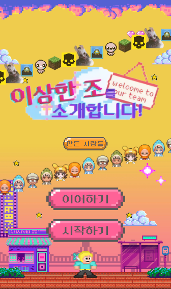
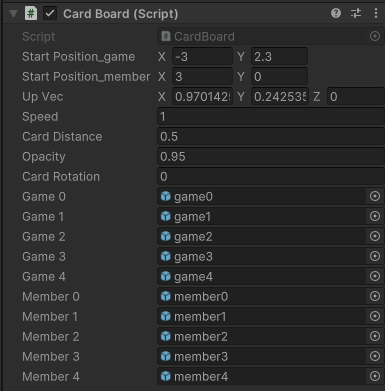
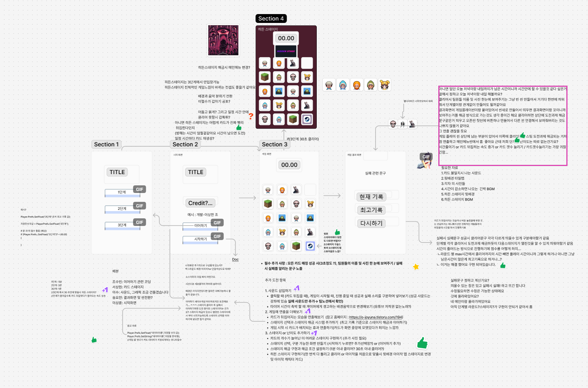

# 미니 프로젝트 "이상한조"

## 프로젝트소개
- 내일배움캠프에서 만나, 첫주 첫 프로젝트

## 팀소개
- 송요한(팀장)
- 서상원
- 이상훈
- 이수
- 조수빈빈

## 프로젝트 계기

## 주요기능

### **Open Scene**

- 이어하기 버튼
    - ChoiceScene 전환
- 시작하기 버튼
    - Main1Scene으로의 전환
- 만든사람들 버튼(팀원 이름 소개)
    - 비활성화 되어있던 객체를 활성화
    - 이후 화면전체 크기의 버튼을 만들어, 어디눌러도 나가도록 제작작
- 카드 미리보기 기능
    - 로고 디자인 위아래로 어떤카드로 진행할지 미리 보여주는 기능
    - 게임카드, 멤버카드 n개 생성해, upVec속성 앞뒤로 움직이며, 각 카드는 특정 값을 넘어설시 제일 마지막 카드 뒤로 위치
    - 시작위치, 흘러갈 방향, 속도, 거리, 투명도, 카드의 Z축 회전 들을 제어할수 있도록 여러 속성값 제작
    

### **Choice Scene**
저장된 레벨 데이터를 불러와서 값에 맞는 레벨에서 부터 이어하기 기능

### **Main Scene**
- 
- 
- 난이도 조절 기능
    - MainScene을 복제해 여러 난이도별 구성을 달리함
    - 카드 앞면을 보여준뒤, 뒷면으로 전환되는 시간에 대한 차등
        - 코 드: 0.5f / (Level / 2)
        - 1단계: 0.5f / (1f / 2) 
        - 2단계: 0.5f / (2f / 2) 
        - 3단계: 0.5f / (3f / 2) 
    - 카드의 종류에 대한 차등
        - 1단계: 카드종류 5개
        - 2단계: 카드종류 7개
        - 3단계: 카드종류 10개

### **Result Scene**

### **Sound**

## 개발기간
- 2025년 01월 20일 - 2025년 01월 24일

## 와이어프레임

